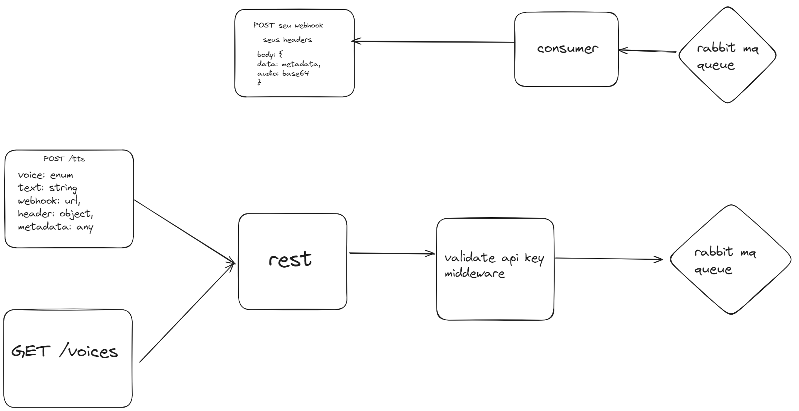

# Contexto
Esse é um monorepo para um api REST para tts coqui com alta disponibilidade.

Ultiliza de webhooks e uma fila amqp para tornar o resultado o melhor possivel e o mais rapido possivel.

**O acesso a ia ainda nao foi liberado, por demo**

# Row To Run
Para ver como rodar, clique [aqui.](./docs/run.md).

# Docs
Para ver a doc, clique [aqui.](./docs/documentation.md).

# System Design
